<div align="center">


# Anamnesis

**Медицинский трекер здоровья с AI-координатором**

[English](README.md) • **Русский**

</div>

---

> Приложение, где всю рутину по заполнению медкарты делает AI: вы просто присылаете документы — PDF, сканы, фото, аудиозаписи приёмов, — а AI-координатор (Claude, ChatGPT, Gemini или локальная модель — на выбор) читает их, извлекает структурированные данные, заполняет БД, связывает записи между собой, подсвечивает отклонения и ведёт план лечения. Вы смотрите на картотеку через удобный PWA-интерфейс.

**Статус**: ранний релиз. Работает, self-hosted, рассчитан на масштаб одной семьи.

### Контекст и философия проекта

Подробный рассказ о мотивации, архитектуре и реальных находках AI-координатора — в моей статье на Хабре:

**→ [Как я построил медицинский трекер здоровья семьи с Claude AI в роли координатора](https://habr.com/ru/articles/1022450/)**

Если хочешь понять «зачем» до «как» — начни со статьи. Этот README — про «как».

---

## Зачем это нужно

Большинство медицинских трекеров требуют вручную вводить десятки полей: диагноз, дозировка, референсные значения анализов, маркеры отклонений, связи между визитами и тестами. Это долго, неинтересно, и через неделю люди обычно бросают.

Anamnesis меняет подход: **AI-координатор** сам читает PDF анализов, расшифровки приёмов, заключения врачей — и заполняет за вас структурированную SQLite-базу. Вы получаете:

- Хронологию визитов с прикреплёнными документами
- Автоматическую подсветку отклонений в анализах
- Кросс-ссылки между диагнозами, препаратами и визитами
- План лечения, который обновляется сам
- Полную историю всех изменений с drill-down

Приложение — это **витрина** для данных. AI — это то, что их **поддерживает в актуальном состоянии**.

## Для кого

- Семьи со сложной медицинской историей (ребёнок с несколькими специалистами, хронические заболевания, частые анализы)
- Разработчики, которым комфортно с self-hosting (Node.js, SQLite, nginx)
- Те, кто уже работает с AI-ассистентом ежедневно и хочет расширить привычку на здоровье
- Параноики, не доверяющие медицинские данные SaaS-облакам

Это **не** приложение для обычного пользователя, ищущего one-tap wellness-трекер.

## Ключевые возможности

### Что видит пользователь

- **Сводка** — статистика, активные диагнозы, текущие препараты, ближайшие напоминания, AI-резюме
- **План** — план лечения и обследований с приоритетами, вкладки pending/done
- **Ошибки** — врачебные ошибки и отклонения в анализах с AI-рекомендациями
- **Приёмы и документы** — визиты к врачам с расшифровками аудио, AI-анализом, прикреплёнными файлами, комментариями
- **Диагнозы** — все диагнозы с опциональной AI-оценкой
- **Анализы** — сгруппированы по тесту, с реф-диапазонами и подсветкой отклонений
- **Прививки** — календарь с фотографиями и реакциями
- **Журнал роста** — рост, вес, окружность головы по датам
- **Справочник специалистов**, **реестр препаратов**, **напоминания**, **полнотекстовый поиск (FTS5)**, **история изменений**, **чат с AI**
- **Экспорт в PDF** — краткая выжимка для нового врача
- **Карта здоровья** (Cytoscape-граф) — визуализация связей между диагнозами, препаратами, специалистами, визитами

### Что делает AI-координатор

Для AI доступен HTTP API (`/api/admin/tools/*`):
- `ai-review` — свежесть сессии
- `integrity` — проверка целостности БД
- `orphan-check` — записи без источника
- `impact` — dry-run удаления
- `sql` — произвольный SQL
- `search` — FTS5 по всей картотеке
- `changelog` — журнал правок
- `mark-reviewed` — закрытие сессии
- `since-last-review` — что нового с прошлого захода
- `backup-now` — ручной бэкап

### Техника

- **Фронт**: React 19, Vite 7, TypeScript strict, React Router 7 (data mode), TanStack Query 5, Motion, PWA с оффлайн-поддержкой (Workbox)
- **Бэк**: Node.js 22, Express, SQLite (WAL mode, foreign keys, FTS5), scrypt-хеширование PIN + WebAuthn-биометрия + device trust + серверный exponential backoff
- **Деплой**: git + systemd (non-root user) + nginx, опционально Telegram-уведомления и offsite-бэкапы в Telegram
- **Мультипациент**: до 4 пациентов в одном инстансе (изоляция данных, отдельный audit_log, UI-свитчер)

## AI-координатор: без привязки к вендору

Anamnesis **не зависит** от конкретного AI-провайдера. Координатор — любая LLM, которая умеет выполнять shell-команды и HTTP-запросы. Мы даём протокол работы (см. [`AI_COORDINATOR_GUIDE.md`](AI_COORDINATOR_GUIDE.md)) — вы подключаете тот инструмент, который вам удобен.

Проверенные связки:
- **[Claude Code](docs/setup/claude-code.md)** (Anthropic) — рекомендуется для клинического мышления
- **[Cursor IDE](docs/setup/cursor.md)** — IDE + AI + терминал в одном
- **[Aider](docs/setup/aider.md)** — CLI для любой модели
- **[Gemini CLI](docs/setup/gemini-cli.md)** (Google)
- **[Локальные модели](docs/setup/ollama-local.md)** через Ollama — Llama 3, Qwen, DeepSeek

Сложные задачи (клинический анализ, поиск противоречий) лучше делать на frontier-моделях. Рутина (перенос данных из PDF) работает и на мелких.

---

## Быстрый старт

### 1. Что нужно

- Node.js ≥ 22
- SQLite ≥ 3.35 (идёт вместе с better-sqlite3)
- `poppler-utils` для конвертации PDF → PNG превью:
  - Linux: `apt install poppler-utils`
  - macOS: `brew install poppler`
  - Windows: [скачать бинарники](https://github.com/oschwartz10612/poppler-windows) и добавить в PATH

### 2. Установка

```bash
git clone https://github.com/Veta-one/anamnesis.git
cd anamnesis

# Бэкенд
cd backend
npm install
cp ../.env.example .env
# Открой .env и заполни:
#   APP_PIN — твой 6-значный PIN
#   API_TOKEN, ADMIN_TOKEN — сгенерируй openssl rand -hex 32
#   BACKUP_ENCRYPTION_KEY — ещё один openssl rand -hex 32 (сохрани в password manager!)
npm run init-db          # создаёт БД с демо-пациентом (Иванов Иван)
npm start                # бэкенд на порту 3010

# Фронтенд (в другом терминале)
cd frontend
npm install
npm run dev              # открывается http://localhost:5173
```

После этого ты увидишь демо-пациента «Иванов Иван Иванович» с одним примером в каждом разделе. Это **стартовое состояние** — все UI-экраны рендерятся заполненными, можно потыкать и понять интерфейс без подключения AI.

### 3. Заменить демо-пациента на своего

Когда хочешь начать пользоваться по-настоящему, подключи AI-координатора (см. гайды выше) и попроси его заменить демо:

```
Привет. Это свежий инстанс Anamnesis. В БД сейчас демо-пациент
Иванов Иван Иванович (patient_id=1). Удали всё что связано с ним
и создай нового пациента:
- ФИО: <твоё ФИО или ФИО ребёнка>
- Дата рождения: YYYY-MM-DD
- Пол: М/Ж

После этого я начну присылать тебе документы.
```

Координатор обернёт это в транзакцию, удалит демо-данные, создаст твоего пациента — и готово. Можно начинать кидать PDF.

### 4. Production-деплой (опционально)

Полный гайд по развёртыванию на собственном VPS (Ubuntu + nginx + Let's Encrypt + systemd hardening + UFW + fail2ban + Telegram-бэкапы) — в [`DEPLOY.md`](DEPLOY.md).

---

## Структура проекта

```
anamnesis/
├── README.md                   English
├── README.ru.md                Этот файл
├── LICENSE                     MIT + медицинский дисклеймер
├── DEPLOY.md                   Production-деплой на VPS
├── AI_COORDINATOR_GUIDE.md     Протокол для AI
├── CONTRIBUTING.md             Как внести вклад
├── .env.example                Шаблон переменных окружения
│
├── backend/                    Node.js + Express + SQLite
│   ├── src/
│   │   ├── index.js            Точка входа: CORS, rate limits, auth
│   │   ├── db.js               Схема + миграции + audit triggers + FTS5
│   │   ├── init-db.js          Сид демо-пациента
│   │   ├── middleware/         auth, audit, patientId, validate
│   │   ├── routes/             API endpoints
│   │   └── services/           backup, telegram, scheduler, changelog, auth-session
│   ├── data/                   [gitignore] SQLite БД + бэкапы
│   └── uploads/                [gitignore] Документы и фото
│
├── frontend/                   React 19 PWA
│   ├── src/
│   │   ├── app/                router, providers, query client
│   │   ├── shared/             UI-примитивы, auth, хуки, layout, утилиты
│   │   └── features/           dashboard, plan, errors, documents, diagnoses, more
│   └── public/                 PWA манифест, иконки
│
└── docs/
    ├── assets/                 Скриншоты и графика для README
    └── setup/                  Гайды подключения разных AI-инструментов
```

## API (обзор для разработчиков)

| Метод | Путь | Описание |
|---|---|---|
| POST | `/api/auth/login` | Вход по PIN → session token |
| POST | `/api/auth/verify-device` | Контрольное слово для нового устройства |
| GET | `/api/dashboard` | Сводка для главной |
| GET/POST/PUT/DELETE | `/api/diagnoses` | Диагнозы |
| GET/POST/PUT/DELETE | `/api/medications` | Препараты |
| GET/POST/PUT/DELETE | `/api/timeline` | Приёмы |
| GET/POST/PUT/DELETE | `/api/documents` | Документы (upload через multipart) |
| GET/POST/PUT/DELETE | `/api/plan` | План лечения |
| GET/POST/PUT/DELETE | `/api/errors` | Врачебные ошибки |
| GET/POST/PUT/DELETE | `/api/lab-results` | Анализы |
| GET | `/api/search?q=...` | FTS5-поиск |
| GET | `/api/patient-context` | Полный снимок (для AI) |
| GET | `/api/history` | Автоматический changelog |
| POST | `/api/admin/tools/sql` | Произвольный SQL (требует ADMIN_TOKEN) |
| GET | `/api/admin/tools/ai-review` | Проверка готовности сессии |
| GET | `/api/admin/tools/integrity` | PRAGMA integrity_check + FK + FTS |
| GET | `/api/admin/tools/orphan-check` | Сущности без источника |
| GET | `/api/admin/tools/impact` | Dry-run удаления |
| POST | `/api/admin/tools/backup-now` | Ручной бэкап |

Полный список endpoints — в [`AI_COORDINATOR_GUIDE.md`](AI_COORDINATOR_GUIDE.md).

## Модель безопасности

### Аутентификация (v4.0 — multi-user)

- **Email + password** (`POST /api/auth/login-password`) — основной вход. Тот же scrypt-хеш, что и для PIN.
- **Изоляция данных по пациентам**: каждый user строго привязан к одному patient через FK. Бэкенд резолвит `req.patientId` из `users.patient_id`; обычный user не может подменить через заголовок `X-Patient-Id` (молча игнорируется).
- **Роли**: `role='admin'` сохраняет override через header и доступ к admin-tools API; `role='user'` заперт на собственного пациента.
- **AI-фичи под флагом**: `users.ai_enabled` контролирует, кто может создавать AI-запросы и пользоваться AI-чатом. Бэк защищает через middleware `requireAiEnabled` на `POST /api/ai-requests`; фронт скрывает соответствующие кнопки.
- **Регистрация** доступна только за Cloudflare Access — `POST /api/auth/register` принимает запрос, только если CF Access прокинул проверенный email через JWT. Без CF — 403.

### Аутентификация (legacy, остаётся рабочей)

- **6-значный PIN** (scrypt-хеш) как per-device fast-path. Доступен из `/login` по ссылке «Войти по PIN».
- **WebAuthn-биометрия** (Face ID / Touch ID / Windows Hello) на устройствах, где зарегистрирован passkey.
- **Device trust**: новое устройство при PIN-входе требует контрольное слово.
- **Серверный exponential backoff**: 3 ошибки → блок 1 мин → 2 → 4 → ... до 24 ч.
- **Сессии в SQLite** (14 дней sliding expiry, IP+UA логирование, ревокация, опциональный `user_id` для multi-user-сессий).

### Внешний слой (опционально)

- **Cloudflare Access** — если в `.env` заданы `CF_ACCESS_TEAM_DOMAIN` и `CF_ACCESS_AUD`, бэкенд валидирует `Cf-Access-Jwt-Assertion` через CF JWKS (кеш 1 ч) на каждом запросе. Идеален как внешний whitelist «только друзей» по email; in-app login остаётся внутри.

### Сеть и hardening

- **Rate limits**: 20 req/15мин на auth, 60 req/мин на admin SQL, 1000 req/15мин на общий API.
- **Строгая валидация загрузок**: whitelist MIME + проверка расширения, SVG запрещён, до 50 МБ.
- **AES-256-CBC/PBKDF2** для ежедневных encrypted-архивов.
- **Systemd hardening** (non-root, ProtectSystem, ProtectKernel*, RestrictSUIDSGID).

Подробности по развёртыванию безопасной инсталляции — в [`DEPLOY.md`](DEPLOY.md).

## Резервное копирование — три уровня

1. **Горячие снимки** каждые 6 часов (локально) — SQLite `.backup()` → `backend/data/backups/`
2. **Полные архивы** ежедневно (локально, шифрованные) — tar.gz с БД и документами, AES-256-CBC/PBKDF2, `BACKUP_ENCRYPTION_KEY`
3. **Offsite в Telegram** — зашифрованный архив улетает в твой личный Telegram-бот. Гео-избыточно. Переживает потерю VPS + GitHub + ноутбука.

**Важно**: `BACKUP_ENCRYPTION_KEY` надо хранить в менеджере паролей **ОТДЕЛЬНО** от сервера. Без ключа Telegram-архивы — бесполезный шифротекст.

## Вклад (Contributing)

PR приветствуются для: багфиксов, UI-фич в рамках модели, setup-гайдов для новых AI, переводов, accessibility, security.

Не подходят: фичи, меняющие модель (облако, соцфункции), привязки к конкретному AI, телеметрия, OAuth-логины.

Подробнее — в [`CONTRIBUTING.md`](CONTRIBUTING.md).

## Лицензия

MIT, см. [LICENSE](LICENSE). **Не является медицинским изделием**. AI-оценки в приложении — не диагноз и не замена консультации врача.

## Скриншоты

Скриншоты взяты с реального инстанса автора и используются с его согласия. На любом другом инстансе UI выглядит точно так же — меняются только данные, структура и взаимодействия одинаковы для всех.

### Сводка — главная с AI-резюме
Статистика, активные диагнозы, текущие препараты, критичные ошибки, ближайшие напоминания, AI-сводка. Красное — приоритеты, оранжевое — под наблюдение, синее — контекст.
<p align="center">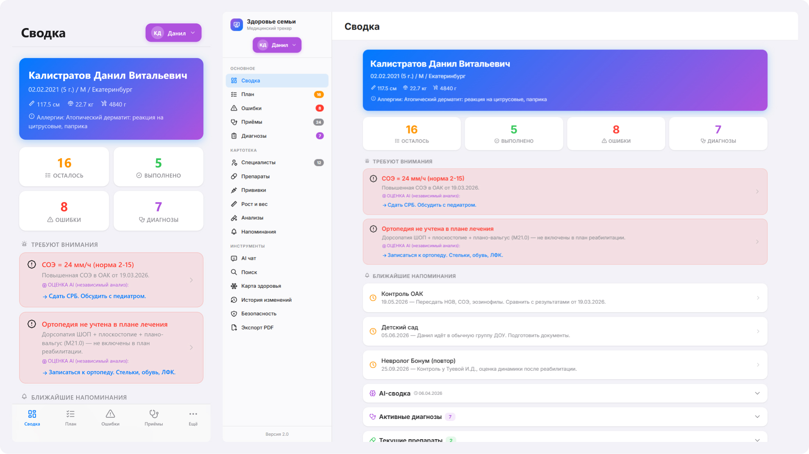</p>

### План и Ошибки
План лечения и обследований с приоритетами (срочно / важно / планово). Врачебные ошибки и отклонения, найденные AI при кросс-проверке.
<p align="center">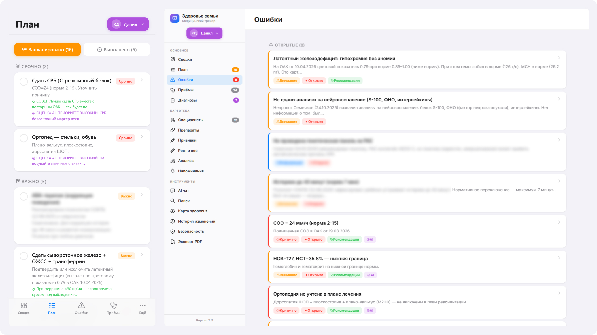</p>

### Карта здоровья — связи
Граф на Cytoscape: связи между диагнозами, врачами, препаратами, анализами, визитами. Тап на узел → drill-down.
<p align="center">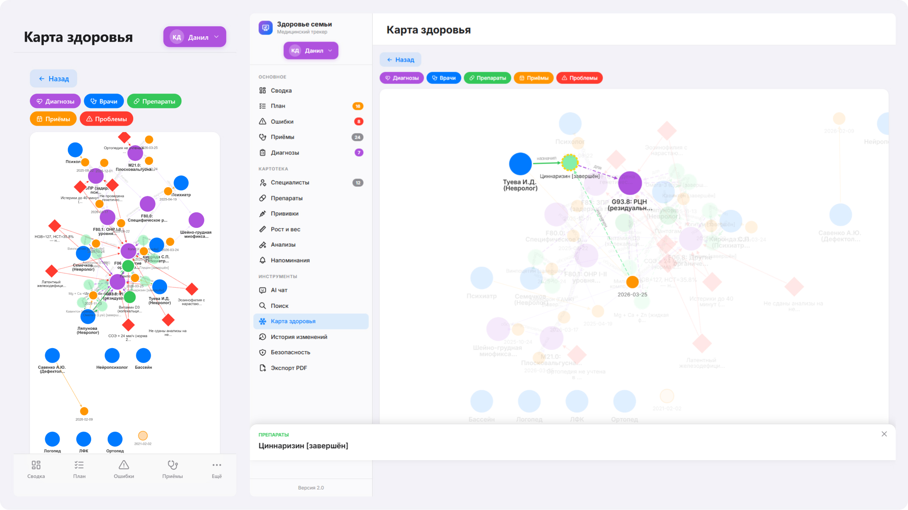</p>

### Приёмы и документы
Хронология визитов к врачам. К каждому приёму прикреплены документы (PDF, сканы), аудиорасшифровки, AI-анализ компетентности специалиста.
<p align="center">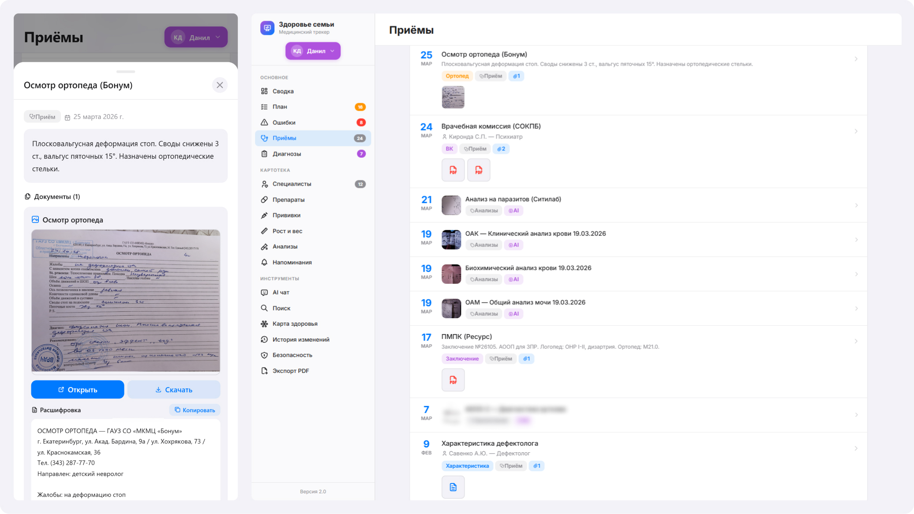</p>

### Расшифровка приёма + AI-анализ
Сырая расшифровка из NotebookLM + структурированный AI-разбор приёма (компетентность врача, полнота осмотра, соответствие гайдлайнам) + комментарии пользователя.
<p align="center">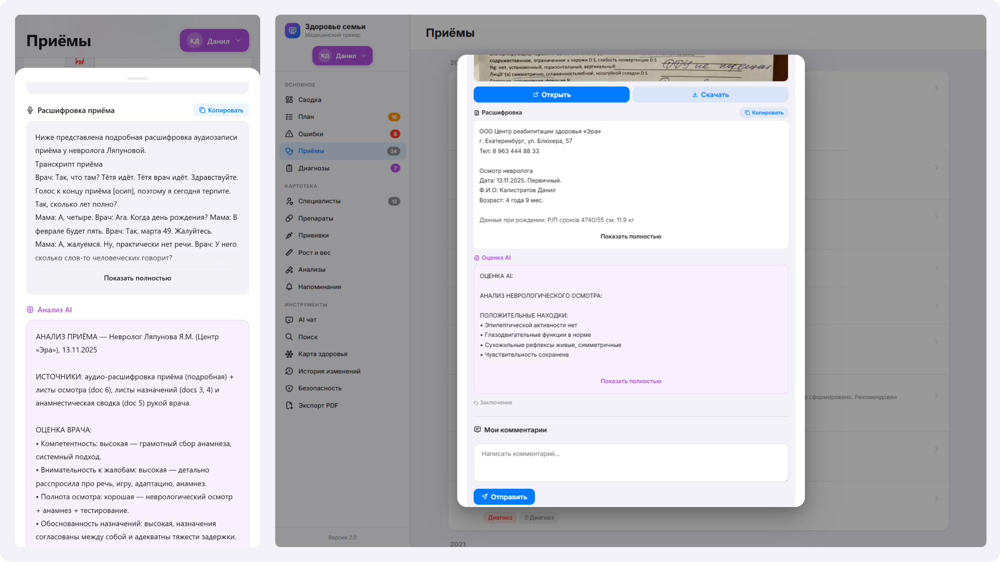</p>

### Форма создания приёма
Структурированный ввод нового приёма: выбор специалиста, загрузка документов, слот для расшифровки NotebookLM.
<p align="center">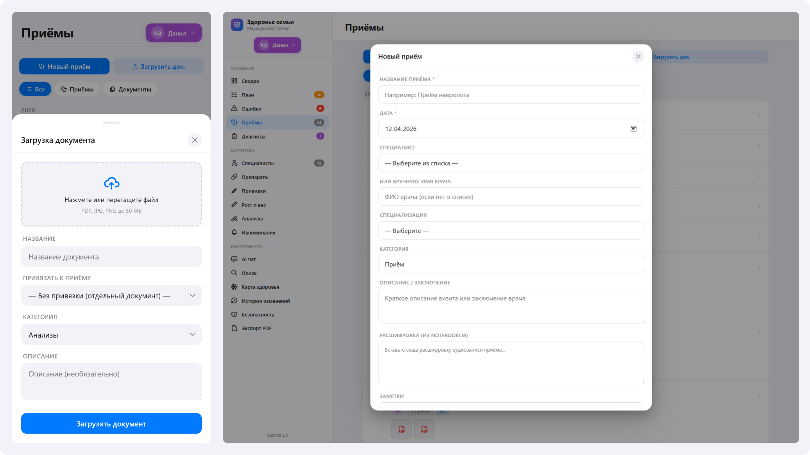</p>

### Анализы — сгруппированные по тесту
Панели анализов сгруппированы по названию и дате, со сроками годности результатов, количеством отклонений, drill-down к отдельным показателям с реф-диапазонами.
<p align="center">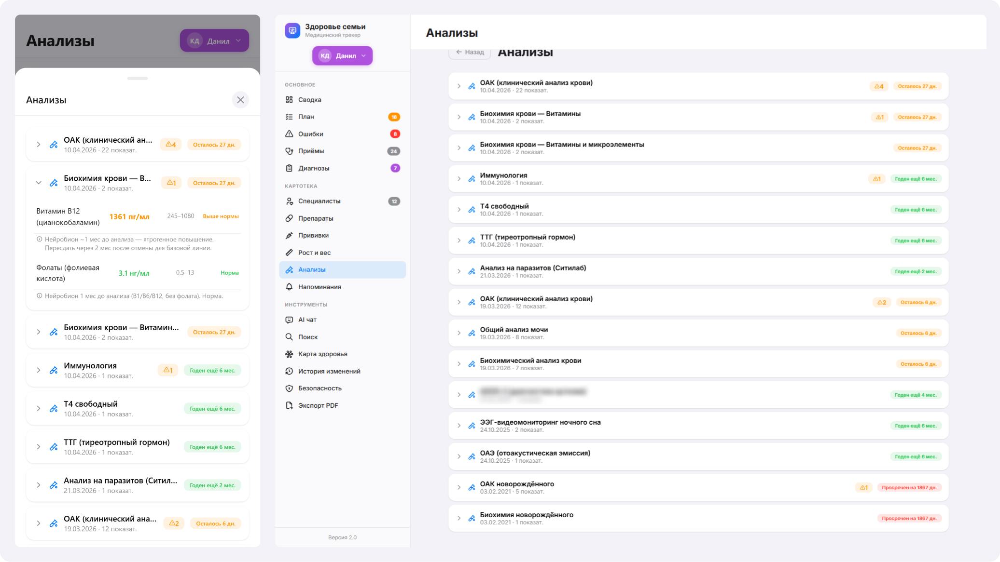</p>

### История изменений — автоматическая per-patient
Каждая правка — сделанная пользователем или AI — пишется через 40 SQLite-триггеров в `audit_log` и отображается человечным feed-ом. Тап на карточку → переход в сущность-источник.
<p align="center">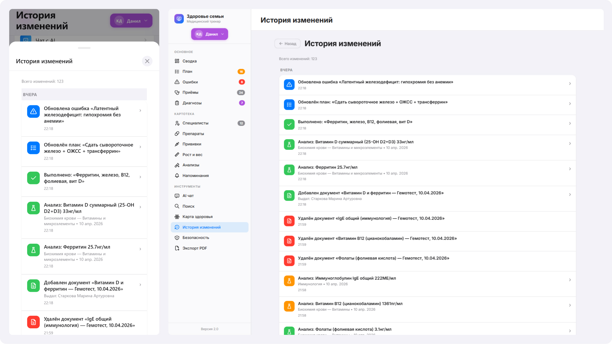</p>

### Безопасность — многофакторная
Face ID / Touch ID / Windows Hello (WebAuthn), PIN, список доверенных устройств с временем последней активности и IP, контрольное слово для новых устройств, кнопка «разлогинить все кроме этого».
<p align="center">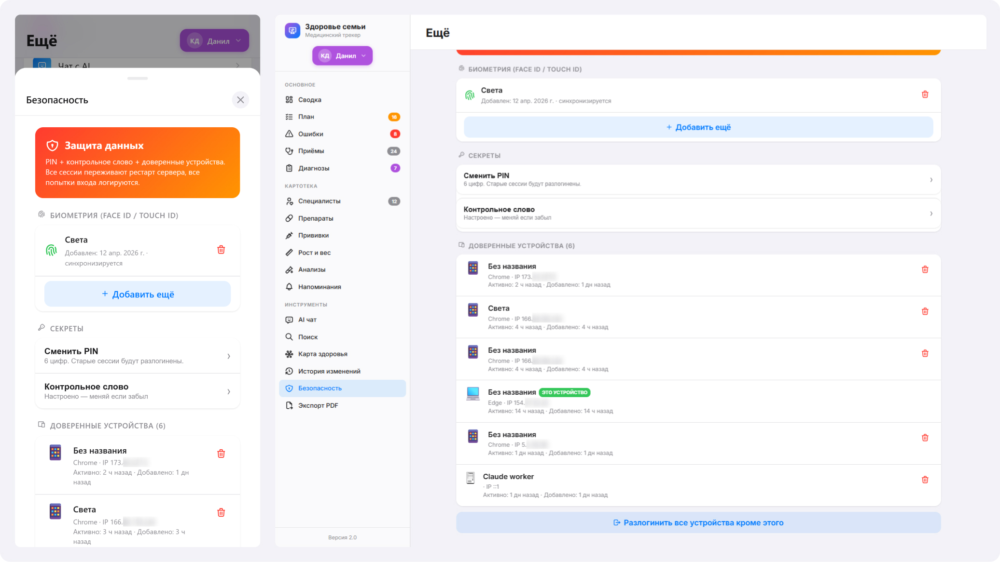</p>

### Резервные копии — три уровня
Горячие снимки каждые 6 часов + зашифрованные ежедневные архивы (AES-256-CBC/PBKDF2) + offsite-копия в Telegram. Переживает потерю VPS.
<p align="center">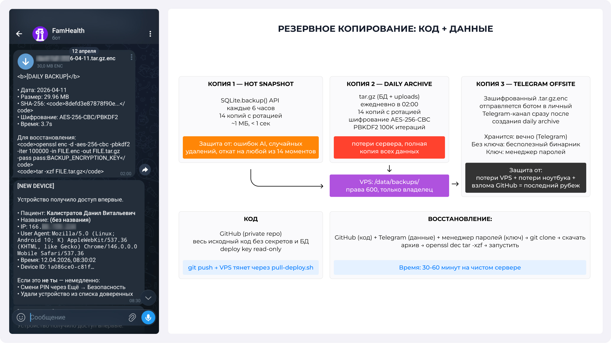</p>

### Не только педиатрия — план для взрослого
Система масштабируется на взрослых пациентов. Здесь: комплексный план чекапа автора, сгенерированный AI с учётом возрастных скрининговых гайдлайнов.
<p align="center">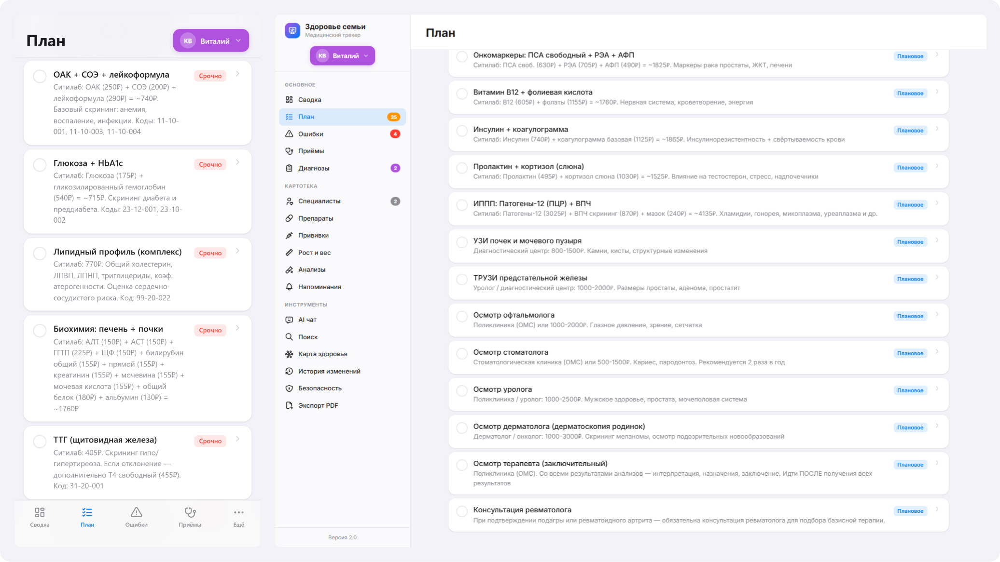</p>

## Автор

Сделано [Veta-one](https://github.com/Veta-one).

Telegram-канал автора: **[@VETA14](https://t.me/VETA14)** — подписывайся если интересно следить за развитием проекта.

Если у тебя ребёнок с проблемами здоровья или близкий человек требует системного отслеживания, и ты думаешь «как же это всё держать в голове» — возможно, этот инструмент тебе поможет. Если захочешь поделиться опытом или предложить идею — пиши в Telegram или открывай issue.
